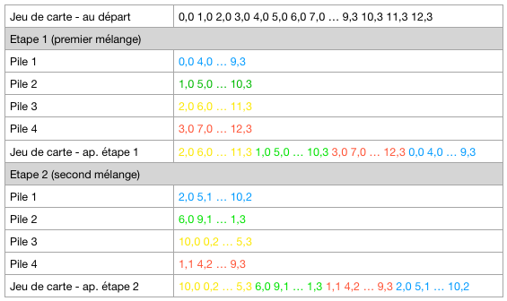

# Mix of cards / Documentation EN

## Presentation

* Language : C++
* Platform : Gamebuino META
* Description : function to mix a set of 52 cards
* Core function : `DeckShuffle->run`

## Commands

While the cards are being displayed :

* Button Left / Right : show other cards (on 3 pages)
* Button A : perform a card shuffling operation

## Explanations

For each shuffling operation :

* The cards are divided into four sub decks of cards.
* You assemble your four sub decks such that the resulting deck of cards is the concatenation of sub deck 3, 2, 4, then 1.

Here is an overview of two mixing operations :



## Code of core function

```
void DeckShuffle::run() {
  uint8_t subSet1 [13] = {255,255,255,255,255,255,255,255,255,255,255,255,255};
  uint8_t subSet2 [13] = {255,255,255,255,255,255,255,255,255,255,255,255,255};
  uint8_t subSet3 [13] = {255,255,255,255,255,255,255,255,255,255,255,255,255};
  uint8_t subSet4 [13] = {255,255,255,255,255,255,255,255,255,255,255,255,255};
  uint8_t it1 = 0;
  uint8_t it2 = 0;
  uint8_t it3 = 0;
  uint8_t it4 = 0;
  // Mix cards
  for(uint8_t i = 0 ; i < 52 ; i++) {
    const uint8_t card = deck->getCard(i);
    const uint8_t s = i % 4;
    switch(s) {
      case 0:
        subSet1[it1] = card;
        it1++;
        break;
      case 1:
        subSet2[it2] = card;
        it2++;
        break;
      case 2:
        subSet3[it3] = card;
        it3++;
        break;
      case 3:
        subSet4[it4] = card;
        it4++;
        break;
    }
  }
  // Re-order cards
  uint8_t n = 0;
  for(uint8_t s = 0 ; s < 4 ; s++) {
    uint8_t * subSet = subSet1;
    switch(s) {
      case 0:
        subSet = subSet3;
        break;
      case 1:
        subSet = subSet2;
        break;
      case 2:
        subSet = subSet4;
        break;
    }
    for(uint8_t c = 0 ; c < 13 ; c++) {
      deck->setCard(n, subSet[c]);
      n++;
    }
  }
  // Statistic
  nbShuffle++;
}
```

Note : the last line `nbShuffle++;` is only useful for this demonstration program.
